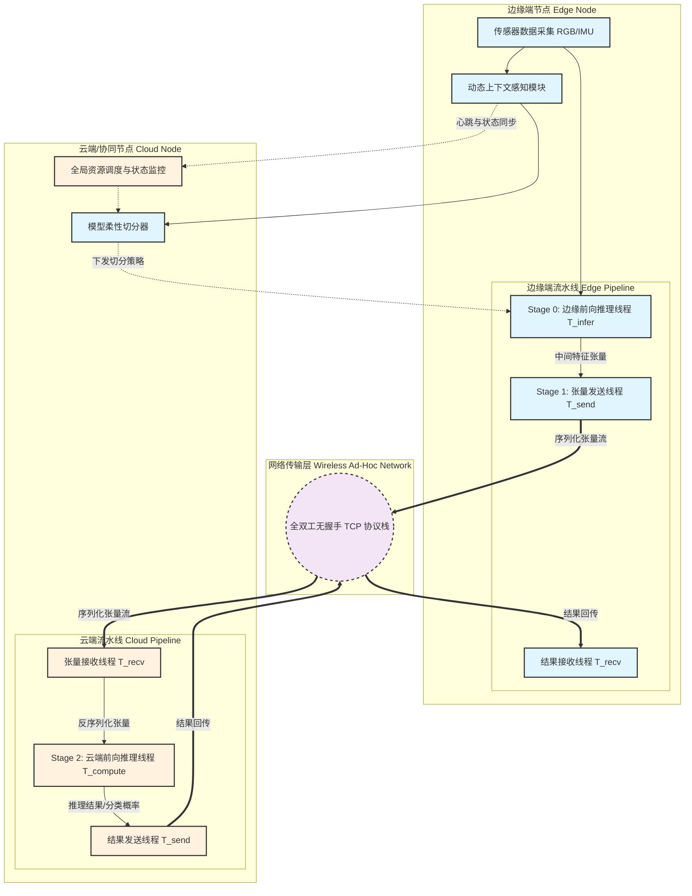

```mermaid
graph TD
    subgraph "边缘端节点 Edge Node"
        A1["传感器数据采集 RGB/IMU"] --> A2[动态上下文感知模块]
        
        
        subgraph "边缘端流水线 Edge Pipeline"
            A4[Stage 0: 边缘前向推理线程 T_infer]
            A5[Stage 1: 张量发送线程 T_send]
            A6[结果接收线程 T_recv]
        end
        
        
        A1 --> A4
        A4 -->|中间特征张量| A5
    end

    subgraph "网络传输层 Wireless Ad-Hoc Network"
        N1(("全双工无握手 TCP 协议栈"))
    end

    subgraph "云端/协同节点 Cloud Node"
        subgraph "云端流水线 Cloud Pipeline"
            C1[张量接收线程 T_recv]
            C2[Stage 2: 云端前向推理线程 T_compute]
            C3[结果发送线程 T_send]
        end
        
        C4[全局资源调度与状态监控]
        C4-.->A3
        A2 --> A3[模型柔性切分器]
        A3 -.->|下发切分策略| A4
    end

    A5 ==>|序列化张量流| N1
    N1 ==>|序列化张量流| C1
    
    C1 -->|反序列化张量| C2
    C2 -->|"推理结果/分类概率"| C3
    C3 ==>|结果回传| N1
    N1 ==>|结果回传| A6
    
    A2 -.->|心跳与状态同步| C4
    %% C4 -.->|全局带宽与算力视图| A2

    classDef edge fill:#e1f5fe,stroke:#333,stroke-width:2px;
    classDef cloud fill:#fff3e0,stroke:#333,stroke-width:2px;
    classDef net fill:#f3e5f5,stroke:#333,stroke-width:2px,stroke-dasharray: 5 5;
    
    class A1,A2,A3,A4,A5,A6 edge;
    class C1,C2,C3,C4 cloud;
    class N1 net;
```