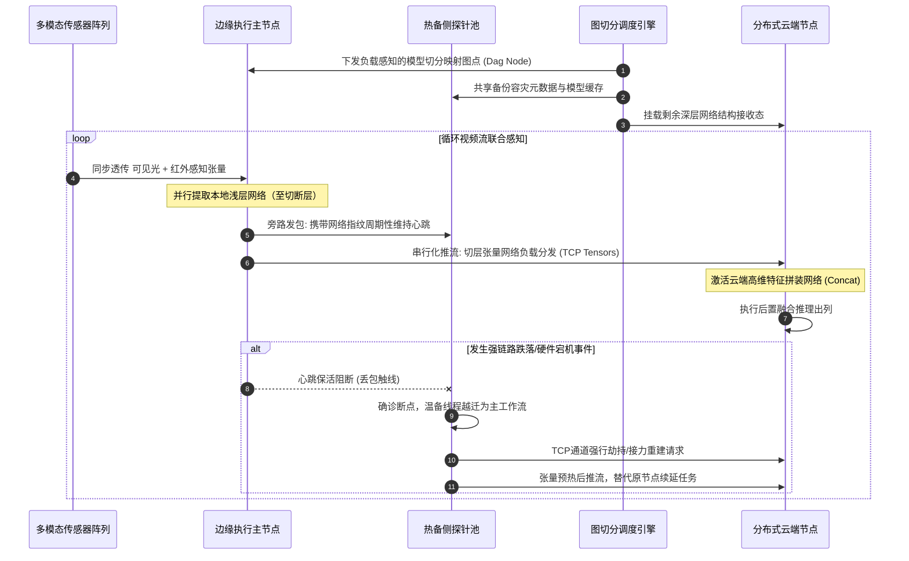

```mermaid
sequenceDiagram
    autonumber
    participant S_Sensor as 多模态传感器阵列
    participant E_Main as 边缘执行主节点
    participant Monitor as 热备侧探针池
    participant Scheduler as 图切分调度引擎
    participant C_Cloud as 分布式云端节点

    Scheduler->>E_Main: 下发负载感知的模型切分映射图点 (Dag Node)
    Scheduler->>Monitor: 共享备份容灾元数据与模型缓存
    Scheduler->>C_Cloud: 挂载剩余深层网络结构接收态
    
    loop 循环视频流联合感知
        S_Sensor->>E_Main: 同步透传 可见光 + 红外感知张量
        note over E_Main: 并行提取本地浅层网络（至切断层）
        E_Main->>Monitor: 旁路发包: 携带网络指纹周期性维持心跳
        E_Main->>C_Cloud: 串行化推流: 切层张量网络负载分发 (TCP Tensors)
        note over C_Cloud: 激活云端高维特征拼装网络 (Concat)
        C_Cloud->>C_Cloud: 执行后置融合推理出列
        
        alt 发生强链路跌落/硬件宕机事件
            E_Main--xMonitor: 心跳保活阻断 (丢包触线)
            Monitor->>Monitor: 确诊断点，温备线程越迁为主工作流
            Monitor->>C_Cloud: TCP通道强行劫持/接力重建请求
            Monitor->>C_Cloud: 张量预热后推流，替代原节点续延任务
        end
    end

```