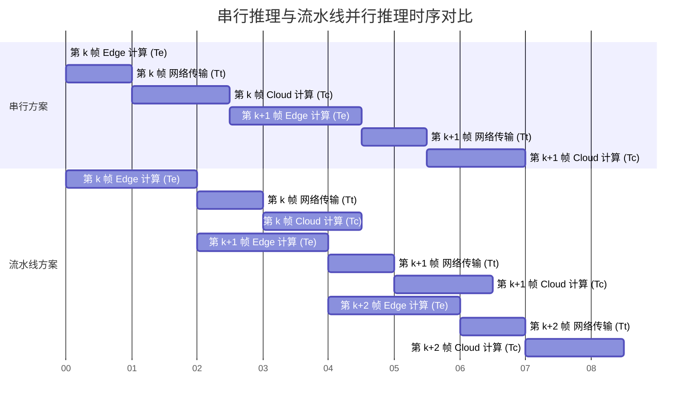

```mermaid
gantt
    title 串行推理与流水线并行推理时序对比
    dateFormat  s
    axisFormat  %S
    
    section 串行方案
    第 k 帧 Edge 计算 (Te)       :a1, 0, 1.s
    第 k 帧 网络传输 (Tt)       :a2, after a1, 1s
    第 k 帧 Cloud 计算 (Tc)      :a3, after a2, 1.5s
    第 k+1 帧 Edge 计算 (Te)     :a4, after a3, 2s
    第 k+1 帧 网络传输 (Tt)     :a5, after a4, 1s
    第 k+1 帧 Cloud 计算 (Tc)    :a6, after a5, 1.5s
    
    section 流水线方案
    第 k 帧 Edge 计算 (Te)       :b1, 0, 2s
    第 k 帧 网络传输 (Tt)       :b2, after b1, 1s
    第 k 帧 Cloud 计算 (Tc)      :b3, after b2, 1.5s
    
    第 k+1 帧 Edge 计算 (Te)     :c1, 2, 2s
    第 k+1 帧 网络传输 (Tt)     :c2, after c1, 1s
    第 k+1 帧 Cloud 计算 (Tc)    :c3, after c2, 1.5s
    
    第 k+2 帧 Edge 计算 (Te)     :d1, 4, 2s
    第 k+2 帧 网络传输 (Tt)     :d2, after d1, 1s
    第 k+2 帧 Cloud 计算 (Tc)    :d3, after d2, 1.5s
```