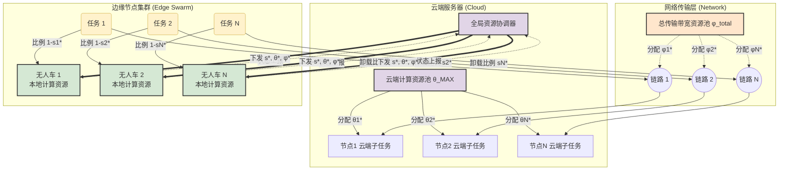

```mermaid
graph TD
    subgraph "云端服务器 (Cloud)"
        C_Coord[全局资源协调器]
        C_Res[云端计算资源池 θ_MAX]
        C_Task1[节点1 云端子任务]
        C_Task2[节点2 云端子任务]
        C_TaskN[节点N 云端子任务]
        C_Res -->|分配 θ1*| C_Task1
        C_Res -->|分配 θ2*| C_Task2
        C_Res -->|分配 θN*| C_TaskN
    end
    subgraph "网络传输层 (Network)"
        N_Band[总传输带宽资源池 φ_total]
        N_Link1(("链路 1"))
        N_Link2(("链路 2"))
        N_LinkN(("链路 N"))
        N_Band -.->|分配 φ1*| N_Link1
        N_Band -.->|分配 φ2*| N_Link2
        N_Band -.->|分配 φN*| N_LinkN
    end
    subgraph "边缘节点集群 (Edge Swarm)"
        E1["无人车 1<br>本地计算资源"]
        E2["无人车 2<br>本地计算资源"]
        EN["无人车 N<br>本地计算资源"]
        T1(任务 1)
        T2(任务 2)
        TN(任务 N)
        T1 -->|比例 1-s1*| E1
        T2 -->|比例 1-s2*| E2
        TN -->|比例 1-sN*| EN
    end
    T1 -->|卸载比例 s1*| N_Link1
    N_Link1 --> C_Task1
    T2 -->|卸载比例 s2*| N_Link2
    N_Link2 --> C_Task2
    TN -->|卸载比例 sN*| N_LinkN
    N_LinkN --> C_TaskN
    E1 -.->|状态上报| C_Coord
    E2 -.->|状态上报| C_Coord
    EN -.->|状态上报| C_Coord
    C_Coord ==>|下发 s*, θ*, φ*| E1
    C_Coord ==>|下发 s*, θ*, φ*| E2
    C_Coord ==>|下发 s*, θ*, φ*| EN
    classDef cloud fill:#e1d5e7,stroke:#333,stroke-width:2px;
    classDef edge fill:#d5e8d4,stroke:#333,stroke-width:2px;
    classDef net fill:#ffe6cc,stroke:#333,stroke-width:2px;
    classDef task fill:#fff2cc,stroke:#d6b656,stroke-width:1px;
    class C_Coord,C_Res cloud;
    class E1,E2,EN edge;
    class N_Band net;
    class T1,T2,TN task;

```